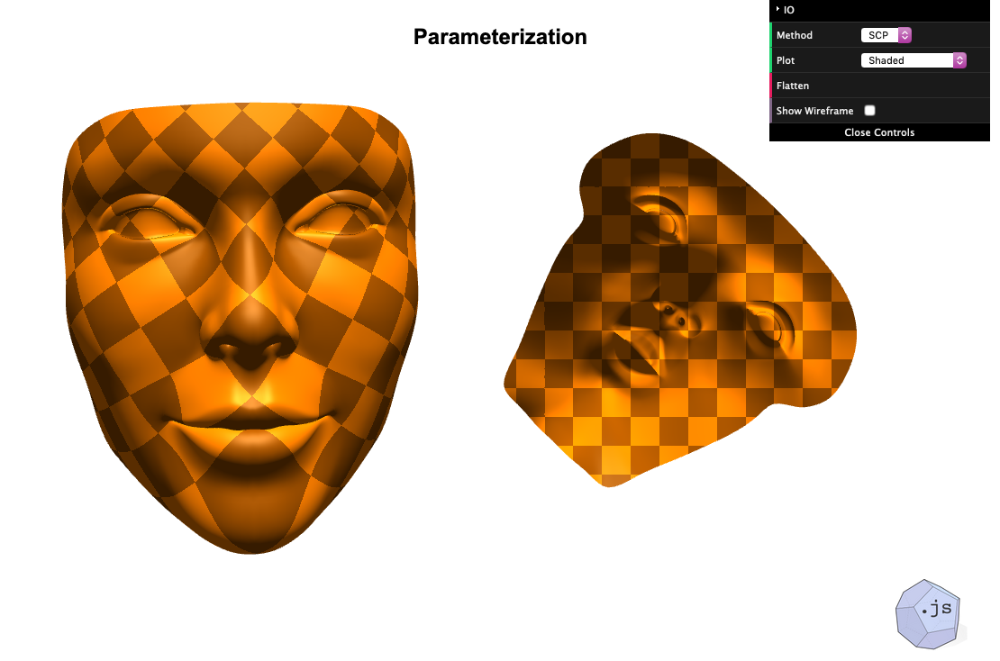

# EmscriptenExample

||
|:----:|
|Spectral Conformal Parameterization in WebAssembly|

This is an implementation of [Spectral Conformal Parameterization](http://geometry.caltech.edu/pubs/MTAD08.pdf). It uses [geometry-processing-js](https://github.com/GeometryCollective/geometry-processing-js) for visualization. The computation is done using [geometry-central](https://github.com/nmwsharp/geometry-central), compiled for the web with [emscripten](https://emscripten.org/). I used a lot of code from Ricky Reusser's cool proof of concept for compiling geometry-central to WebAssembly, which you can find [here](https://observablehq.com/d/d0df0c04ce5c94fc).

You can try it out online [here](https://markjgillespie.com/Demos/EmscriptenExample/html/).

## Building
This project uses git submodules. To clone it, run `git clone https://github.com/MarkGillespie/EmscriptenExample --recursive`.

To build this code, you need to [install Emscripten](https://emscripten.org/docs/getting_started/downloads.html).

Once you have Emscripten, then building this code is just like building an ordinary `geometry-central` project.
```bash
mkdir build
cd build
emcmake cmake -DCMAKE_BUILD_TYPE=Release ..
emmake make -j7
```
This creates two "binaries", `bin/embind.js` and `bin/embind.wasm`. Then, you should copy these files into the `html` directory.

Because of some browser stuff, these `embind` files need to be served from a server - the page doesn't work if you just open the file locally.

Note that I had to include Eigen as an explicit dependency. Emscripten didn't like geometry-central's fancy on-the-fly Eigen downloader. But if you just include Eigen as a dependency everything works fine.
